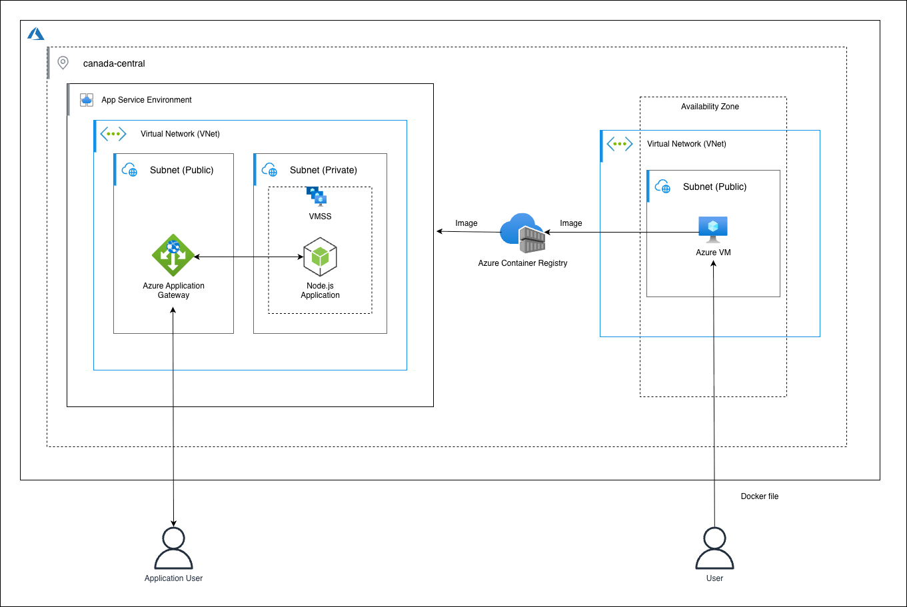

# Lab 8 – Deploy Azure Container Registry Image with Azure App Service for Containers

## Overview

In this lab, you’ll build and push a **Docker image** to **Azure Container Registry (ACR)**, then deploy it using **Azure App Service (Web App for Containers)** — the Azure-native equivalent of deploying a containerized app from **ECR → Elastic Beanstalk**.

By the end of this lab, you will be able to:

- Understand how **Azure App Service** abstracts infrastructure similar to **Elastic Beanstalk**.
- Create a **private Azure Container Registry (ACR)**.
- Build and push a **Docker image** to ACR.
- Deploy a containerized **Node.js** application from ACR to **Web App for Containers**.
- Configure identity & access between App Service and ACR.
- Clean up resources safely.

---

## Technologies Used

- **Azure Container Registry (ACR)**
- **Azure App Service (Web App for Containers)**
- **Azure Virtual Machine (Ubuntu)** – for building images
- **Azure Resource Group**
- **Managed Identity / ACR authentication**

---

## Architecture Diagram

The architecture:

1. A **Linux VM** (build host) builds a Docker image.
2. The image is pushed to a **private ACR** repository.
3. An **Azure App Service (Web App for Containers)** pulls the image from ACR.
4. App Service runs the container behind a managed endpoint with scaling options.

Diagram (conceptual):

- **Client** → `https://lab8-webapp.azurewebsites.net`
- **Azure App Service (Docker on Linux)**  
  ↕ pulls image from
- **Azure Container Registry (ACR)**
- **(Optional) Build VM** inside Azure used to build & push image.



---

<details>
<summary><b>1️ Getting Started & Lab Guidelines</b></summary>

**Azure App Service** is a fully managed platform for hosting web apps, APIs, and containers without managing underlying VMs, load balancers, or OS patching — similar in spirit to **AWS Elastic Beanstalk**.

In this lab, you will:

- Create an **ACR** repository.
- Build a Docker image on an **Azure VM** and push it to ACR.
- Deploy that image using **Azure App Service for Containers**.

### Guidelines

- **Region:** use `Canada Central` (or another region that supports Linux App Service & ACR).
- Use the exact names suggested (or adjust only where `<unique>` is required).
- All resources live in **one resource group** for easy cleanup.
- You may see extra options/features not required for this lab — stick to the steps below.

### Naming Convention

Use (or adapt) the following names:

- Resource Group: `acr-appservice-lab8-rg`
- Container Registry: `lab8acr<unique>`  
  (must be globally unique, only lowercase letters & numbers)
- VM: `lab8-build-vm`
- App Service Plan: `lab8-asp-linux`
- Web App (Container): `lab8-webapp-<unique>`
- Image Name: `lab8-node-app`

</details>

---

<details>
<summary><b>2️ Create a Private Azure Container Registry (ACR)</b></summary>

We’ll start by creating a **private** Azure Container Registry to store our Docker image — equivalent to **ECR private repository**.

1. In the **Azure Portal**, search for **Resource groups** → click **+ Create**.

   - Subscription: your active subscription
   - Resource group: `acr-appservice-lab8-rg`
   - Region: `Canada Central`
   - Click **Review + create → Create**.

2. After it’s created, go to `acr-appservice-lab8-rg` → click **+ Create** → search **Container Registry**.

3. Create **Azure Container Registry**:
   - Registry name: `lab8acr<unique>`
   - Region: `Canada Central`
   - SKU: **Basic**
   - Resource group: `acr-appservice-lab8-rg`
   <!-- - Admin user: **Disabled** (we’ll use Azure identity or `az acr login`) -->
   - Click **Review + create → Create**.

Once deployment is complete:

- Go to your ACR resource.
- Note the **Login server**, e.g. `lab8acr<unique>.azurecr.io`.

</details>

---

<details>
<summary><b>3️ Build & Push a Docker Image to ACR</b></summary>

In the original lab, you used an **EC2 instance** to build and push an image.  
Here, we’ll use an **Azure Linux VM** as our build host and push to ACR.

### 3.1 Create a Linux VM (Build Host)

1. In the Azure Portal, search for **Virtual Machines** → **+ Create → Azure virtual machine**.

2. **Basics:**

   - Subscription: your active subscription
   - Resource group: `acr-appservice-lab8-rg`
   - VM name: `lab8-build-vm`
   - Region: `Canada Central`
   - Image: **Ubuntu Server 24.04 LTS**
   - Size: `Standard_B1s` or similar
   - Authentication type: SSH public key
   - Username: `azureuser`
   - Generate or upload SSH key as preferred.
   - Public inbound ports: **Allow SSH (22)**.

3. Leave defaults on other tabs where not mentioned.
4. Click **Review + create → Create**.

Wait until the VM is in **Running** state.

---

### 3.2 Connect to the VM & Install Docker

Connect to the VM via Azure Bastion

1. In the Azure Portal, open your VM: `vm-app-lab7`.
2. Click **Connect → Bastion**.
3. Enter:
   - **Username:** `azureuser`
   - **Authentication type:** Use the SSH key generated earlier or your portal credentials.
4. Click **Connect** — a secure terminal session will open in your browser.

Then run:

```bash
sudo apt-get update -y
sudo apt-get install -y ca-certificates curl gnupg
sudo install -m 0755 -d /etc/apt/keyrings
curl -fsSL https://download.docker.com/linux/ubuntu/gpg | sudo gpg --dearmor -o /etc/apt/keyrings/docker.gpg
echo   "deb [arch=$(dpkg --print-architecture) signed-by=/etc/apt/keyrings/docker.gpg]   https://download.docker.com/linux/ubuntu $(lsb_release -cs) stable" |   sudo tee /etc/apt/sources.list.d/docker.list > /dev/null

sudo apt-get update -y
sudo apt-get install -y docker-ce docker-ce-cli containerd.io
```

---

### 3.3 Verify Docker Installation

```bash
docker --version
sudo systemctl status docker
```

Add your user to the Docker group:

```bash
sudo usermod -aG docker $USER
newgrp docker
```

---

### 3.4 Retrieve ACR Details & Login (Manual)

1. In the **Azure Portal**, open your **Container Registry**.
2. Go to **Access keys** → Copy:
   - **Login server** (e.g., `lab8acr12345.azurecr.io`)
   - **Username**
   - **Password**

Log in from Bastion:

```bash
docker login <ACR_LOGIN_SERVER> -u <USERNAME> -p <PASSWORD>
```

Example:

```bash
docker login lab8acr12345.azurecr.io -u lab8acr12345 -p MySecretPassword
```

---

### 3.5 Fetch Sample App & Dockerfile

Create the working directory and Dockerfile:

```bash
mkdir lab8-app && cd lab8-app
```

Create the Dockerfile:

```bash
cat << 'EOF' > Dockerfile
FROM node:18-alpine

WORKDIR /app

RUN npm install -g serve

COPY . /app

RUN echo '<h1>Lab 8 - Azure Container Registry + App Service (Web App for Containers)</h1>' > index.html

EXPOSE 8080

CMD ["serve", "-s", ".", "-l", "8080"]
EOF
```

---

### 3.6 Build, Tag & Push Image to ACR

Set your ACR and image variables:

```bash
ACR_LOGIN_SERVER="lab8acr12345.azurecr.io"
IMAGE_NAME="lab8-node-app"
TAG="v1"
```

Build the Docker image:

```bash
docker build -t $IMAGE_NAME:$TAG .
```

Tag the image:

```bash
docker tag $IMAGE_NAME:$TAG $ACR_LOGIN_SERVER/$IMAGE_NAME:$TAG
```

Push the image:

```bash
docker push $ACR_LOGIN_SERVER/$IMAGE_NAME:$TAG
```

You should now see it under  
**ACR → Repositories → `lab8-node-app` → `v1`**

</details>

---

<details>
<summary><b>4️ Deploy the Docker Image with Azure App Service (Web App for Containers)</b></summary>

Now we’ll deploy the ACR image to **Azure App Service**.

### 4.1 Create an App Service Plan (Linux)

1. In the Azure Portal, search **App Service plans** → **+ Create**.
2. Basics:
   - Subscription: your subscription
   - Resource group: `acr-appservice-lab8-rg`
   - Name: `lab8-asp-linux`
   - Operating system: **Linux**
   - Region: `Canada Central`
3. Pricing plan: choose **Basic B1** or a low dev tier **Free F1**.
4. Click **Review + create → Create**.

---

### 4.2 Create the Web App (Container)

1. Search **App Services** → **+ Create**.
2. **Basics:**

   - Subscription: your subscription
   - Resource group: `acr-appservice-lab8-rg`
   - Name: `lab8-webapp-<unique>`
   - Publish: **Docker Container**
   - Operating System: **Linux**
   - Region: `Canada Central`
   - App Service plan: `lab8-asp-linux`

3. Click **Next: Container**.

4. **Container tab:**

   - Image Source: **Azure Container Registry**
   - Registry: select your `lab8acr<unique>`
   - Image: `lab8-node-app`
   - Tag: `v1`
   - Port: `8080` (to match the Dockerfile)

5. Click **Review + create → Create**.

Azure App Service will:

- Pull the image from **ACR**
- Start the container
- Expose it at: `https://lab8-webapp-<unique>.azurewebsites.net/`

---

### 4.3 Verify the Deployment

1. Go to your **Web App** (`lab8-webapp-<unique>`).
2. Confirm **Status: Running**.
3. Click **Browse** (or open the URL in your browser).

You should see:

```html
Lab 8 - Azure Container Registry + App Service (Web App for Containers)
```

If it doesn’t load:

- Go to **Web App → Container settings / Logs** to check pull/start errors.
- Ensure the **Port** is set to `8080`.
- Confirm the image exists in ACR and tag is correct.

</details>

---

<details>
<summary><b>5️ Clean Up</b></summary>

To avoid unnecessary charges, clean up all resources created in this lab.

### Option A (Recommended): Delete the Resource Group

1. In the Azure Portal, search for **Resource groups**.
2. Select `acr-appservice-lab8-rg`.
3. Click **Delete resource group**.
4. Type `acr-appservice-lab8-rg` to confirm → **Delete**.

This will remove:

- ACR
- App Service plan
- Web App
- VM & its public IP/NIC/disk
- Any related resources.

### Option B: Manual Cleanup (if needed)

- Delete **Web App** and **App Service Plan**.
- Delete **ACR**.
- Delete **VM**, **NIC**, **Public IP**, **Disk**.
- Delete the **Resource Group** last.

</details>

---

## Summary

In this lab, you:

- Created a **private Azure Container Registry**.
- Built a Docker image on an **Azure Linux VM**.
- Pushed the image to ACR.
- Deployed that image using **Azure App Service (Web App for Containers)** — Azure’s managed, PaaS-style environment comparable to **Elastic Beanstalk**.
- Verified the running container and cleaned up all resources in one shot.

You’ve now replicated the **ECR → Elastic Beanstalk** deployment pattern using **ACR → App Service for Containers** in Azure.
